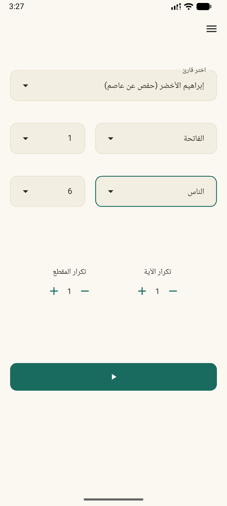
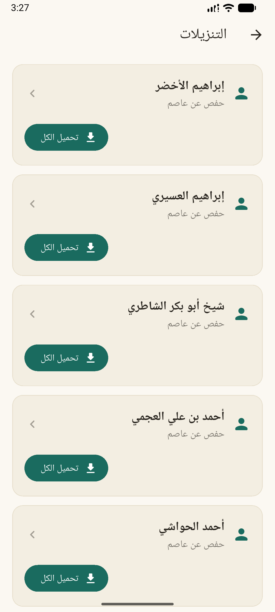
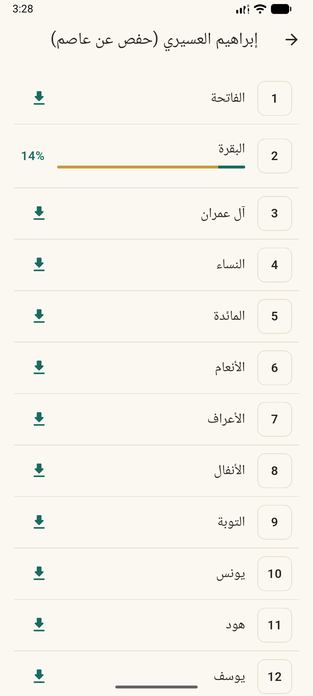
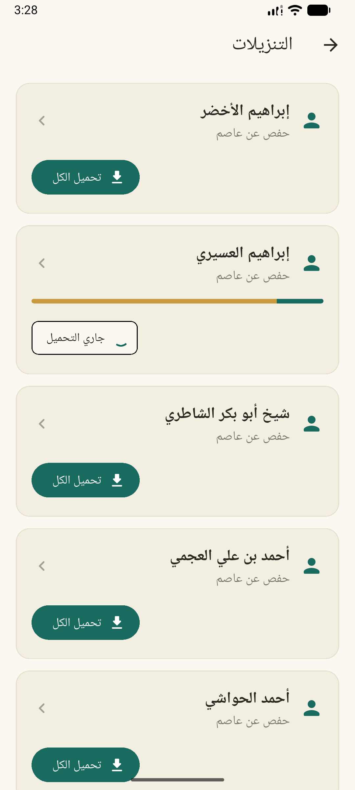
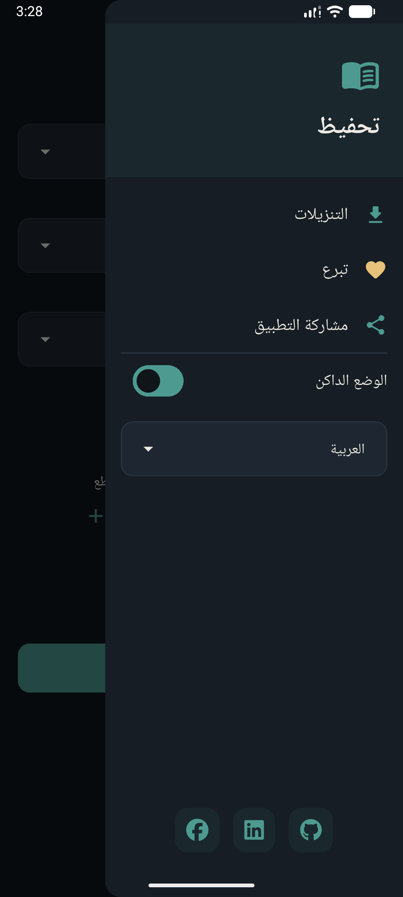
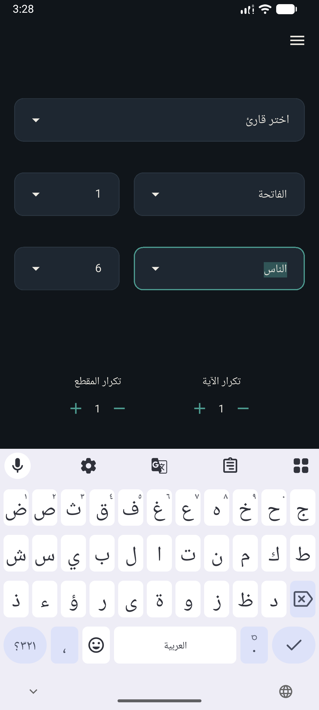
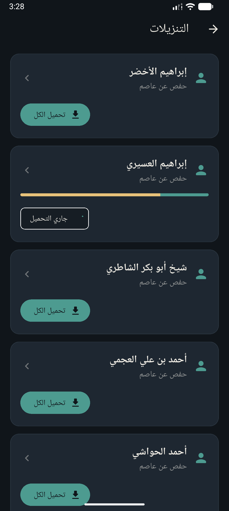
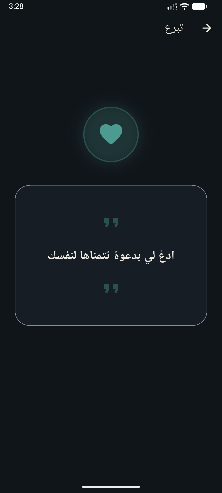
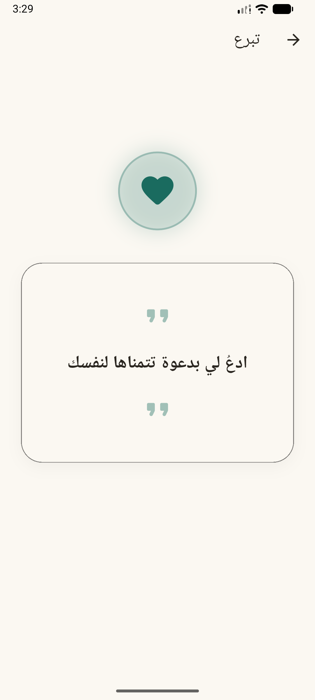

<div align="center">

# 📖 Tahfez | تحفيظ

**A modern, open-source Holy Quran memorization assistant and repetition application built with Flutter.**

Designed to help Muslims around the globe memorize (Hifz) and retain the Holy Quran effortlessly through intelligent, custom audio repetition workflows.

[](https://play.google.com/store/apps/details?id=tahfez.allam.labs)

---

[](./LICENSE)
[](https://flutter.dev)
[](#)
[](#)
[](#)

</div>

---

## 🌟 About Tahfez

**Tahfez (تحفيظ)** is an intuitive, high-performance Quran recitation and memorization tool designed around the proven dual-level repetition technique.

Whether you are revising a Juz', memorizing a new Surah, or practicing Ayah by Ayah, Tahfez gives you complete control over playback iterations with zero UI stuttering or lag:

* **1️⃣ Verse (Ayah) Repetition**: Specify how many times each individual verse is repeated before moving to the next (e.g., repeat Ayah 1 twice, Ayah 2 twice, etc.).
* **2️⃣ Surah / Range Iteration**: Specify how many times the overall Surah or selected section repeats in total (e.g., repeat the entire Surah 3 times, with every verse repeated twice per iteration).
* **⚡ High-Volume Smooth Repetition**: Engineered to handle high-frequency loop counts seamlessly without audio stutter or memory leaks.
* **📱 Background & Lock-Screen Playback**: Continue your memorization seamlessly with the screen locked or while using other apps.
* **📶 Full Offline Support**: Download complete Surahs or entire reciter libraries to listen anytime, anywhere without an internet connection.

---

## 📱 Screenshots

<div align="center">

| Home & Reader Selection | Audio Player & Timing | Repetition Controls |
| :---: | :---: | :---: |
|  |  |  |

| Offline Downloads | Surah List | Custom Options |
| :---: | :---: | :---: |
|  |  |  |

| Player Highlights | Dark & Light Modes | Full Quran Downloads |
| :---: | :---: | :---: |
|  |  |  |

</div>

---

## ✨ Key Features

* 🔁 **Dual-Layer Custom Repetition Engine**: Fine-tune verse-level repetitions and overall Surah iteration loops.
* ⚡ **Smooth High-Volume Loops**: Built to perform flawlessly even with high repetition numbers (e.g. 20x, 50x, 100x repeats per verse/section) without UI freezes or audio buffer glitches.
* 📱 **Background & Locked-Screen Audio Service**: Seamless background audio playback with full notification bar controls and lock-screen widget support via `just_audio` and `audio_service`.
* 📶 **Full Offline Mode & Background Downloads**: Download individual Surahs or entire Quran audio libraries for offline memorization anytime without needing internet.
* 🎧 **Famous Reciters Library**: Stream or download recitations from top reciters around the world via MP3Quran.
* ⏱️ **Ayah Audio Synchronization**: Real-time Ayah highlighting synced with precise audio timing data.
* 🌍 **Bilingual Interface**: Native support for **Arabic (RTL)** and **English (LTR)** with instant language switching.
* 🌙 **Dynamic Themes**: Beautiful, modern UI tailored for day and night study sessions.
* 🛡️ **100% Free & Ad-Free**: No paywalls, no tracking, and strictly zero advertisements.

---

## 🏗️ Architecture & Tech Stack

Tahfez is built following **Clean Architecture** principles and modular feature-first project organization (`lib/modules/`).

```
lib/
├── app/                  # Application initialization, theme, router, & localization
├── core/                 # Shared core utilities, DI, network client, & local storage
│   ├── data/             # Dio client, Hive storage, secure storage
│   ├── di/               # Service locator (GetIt) dependency injection
│   └── error/            # Unified failure and exception handlers
└── modules/              # Feature modules (Domain, Data, Presentation)
    ├── reader/           # Reciter management & catalog
    └── surah/            # Audio player, Ayah timing, repetition logic, & downloader
```

### Key Libraries & Packages
* **Framework**: Flutter SDK (Dart `^3.12.0`)
* **State Management**: `flutter_bloc` & `hydrated_bloc` (persistent BLoC state)
* **Dependency Injection**: `get_it`
* **Audio Engine**: `just_audio`, `audio_service`
* **Background Tasks**: `background_downloader`
* **Network & Data**: `dio`, `pretty_dio_logger`, `fpdart`
* **Local Storage**: `hive`, `hive_flutter`, `flutter_secure_storage`
* **Localization**: `easy_localization`
* **UI Utilities**: `flutter_screenutil`

---

## 🚀 Getting Started

### Prerequisites

Ensure you have the following installed on your development machine:
* [Flutter SDK](https://docs.flutter.dev/get-started/install) (`>= 3.12.0`)
* [Dart SDK](https://dart.dev/get-dart)
* Android Studio / Xcode (for running mobile emulators or devices)

### Installation

1. **Clone the repository**:
   ```bash
   git clone https://github.com/allam/tahfez.git
   cd tahfez
   ```

2. **Install dependencies**:
   ```bash
   flutter pub get
   ```

3. **Run the app**:
   ```bash
   flutter run
   ```

---

## 🌐 API & Data Acknowledgments

Tahfez relies on audio recitations and Quranic meta-data served by:

* **[MP3Quran API](https://www.mp3quran.net/ar/api)** (`https://www.mp3quran.net/api/v3/`)

We express our sincere gratitude to the MP3Quran team for providing free, high-quality Quranic recitations to the global Muslim developer community.

---

## 📜 License & Open-Source Policy

This project is licensed under the **GNU General Public License v3.0 (GNU GPL-3.0)** — a strong **Copyleft** license.

### 🛡️ Non-Commercial & Ad-Free Commitment
* **100% Free & Open-Source**: Anyone is free to use, study, modify, and distribute this codebase.
* **No Paywalls & No Ads**: Any derivative work, fork, or redistributable version **MUST remain open-source under the GNU GPL-3.0 license**, free of charge, and strictly without advertisements or commercial monetization.

For full license details, please read the [LICENSE](./LICENSE) file.

---

<div align="center">

Made with ❤️ for the Ummah. If Tahfez helps you in your Quran memorization journey, please consider starring ⭐ this repository!

</div>
